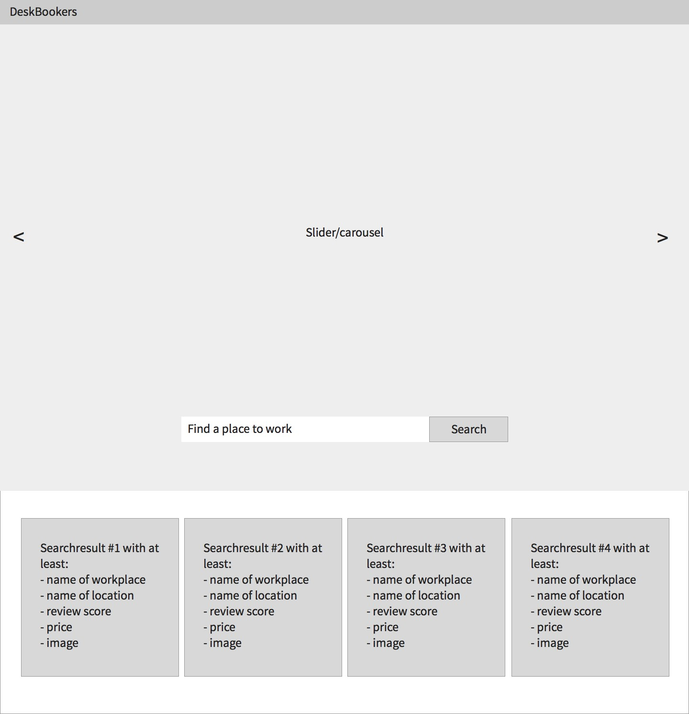

# Frontend test
This test is made to check if you know your css, javascript and html. We will also be looking at what your design looks like, so it's not all technical, we also expect you to be able to make things that look good.

You are allowed to use a javascript framework to your liking for example jQuery, Angular or React. Don't use a CSS Framework please. SASS or LESS are bonus points (if done properly).

The assignment is to create a simple webpage with a few elements. There should be a navigation bar, under that a slider or carousel with some images of nice workplaces. On top of the slider goes a searchbar. The results of the search show under the slider. Check also the minimal wireframe when you scroll down.

## Navigation bar
Together with the slider the height should be 100% of the window height. You don't have to put anything in the navigation bar except something like a logo.

## Slider/carousel
This can be a pretty basic slider. Don't use an external library, we want to see how YOU code ;).
Make sure that:
* The image shows nicely and fills the screen.
* Together with the navigation bar this should be 100% height. So the bottom of the slider is the bottom of your browser screen.
* A way to go to another slide with buttons (can be arrows on the sides or circles on the bottom of the slider for example).
* Bonus points if you make a headline in each slide that is always vertically and horizontally centered.

## Search
Make a search-bar on top of the slider so it doesn't slide along with the slides. The results of the search should show under the slider, you can pick how many you want to show. 

The data for the search results can be found as JSON from the URL: https://www.deskbookers.com/nl-nl/sajax.json?q=Amsterdam&type=-&people=any&favorite=0&pid=&sw=52.293753%2C4.634942&ne=52.455562%2C5.162286&ids=17201%2C19640%2C13692%2C13691%2C12136%2C17938%2C15292%2C14886%2C14885%2C14884%2C14883%2C15730%2C15353%2C15351%2C15330%2C15080%2C17290%2C15454%2C15451%2C15379

Make sure that: 
* The search results have an image, workplace name, location name, review score and price.
* You get the search results via an API call
* Bonus points if you add a map that shows the search results.

## Criteria
We will be looking at the following things:
* Code quality
* Interface design & usability
* Responsiveness
* Any extra creativity

